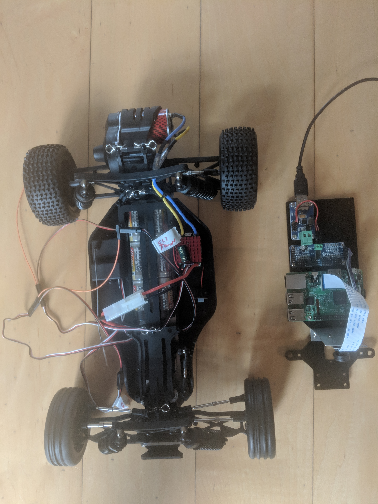
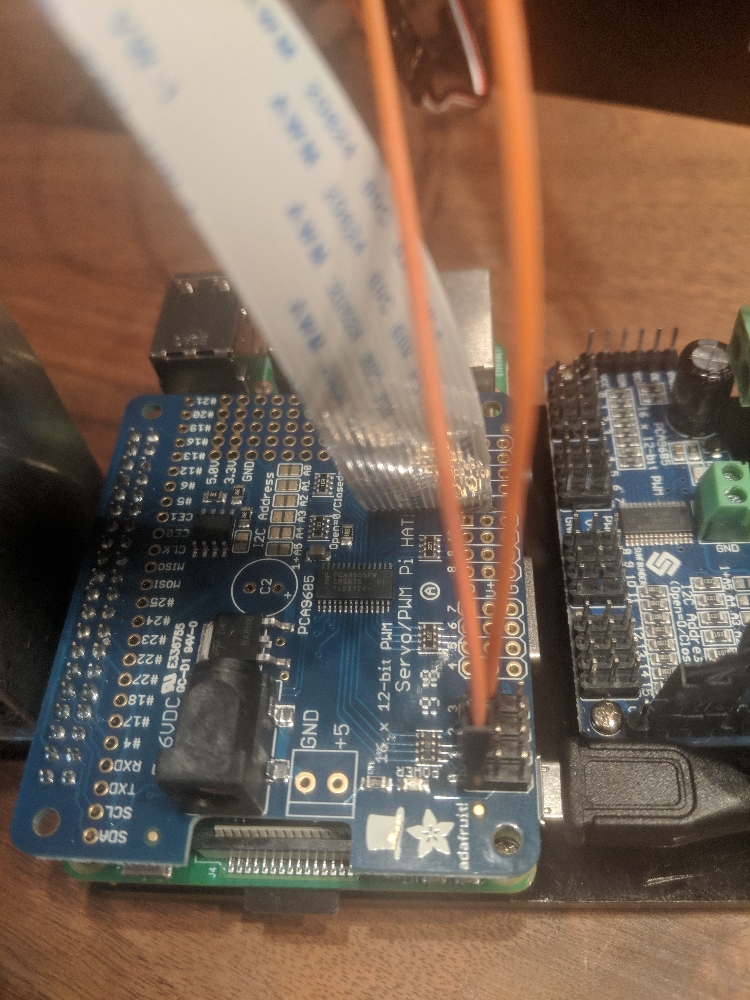

# Change to donkeycar {#donkeyCar}

In December 2018 I switched from sunfounder to donkeycar 
[Donkey Car](http://www.donkeycar.com "Donkey Car's Homepage")

## Reason for changing the plattform
The sunfounder was wonderful to learn the basics, PWM, I2C, use of camera with Pi, but had shortcommings in the steering mechanism. The steering angle was not reproducable, i.e. sending twice the same steering command did result in different steering angles of about a few degrees difference. Now since the aim of the game is to train a neural net which takes the commanded steering angle as ground truth this was a show stopper for me and therefore i moved to => Donkey Car  

Second reason, other members of the group [Esslinger Makerspace Projekt: Autonomen RoboCar bauen](https://www.meetup.com/Esslingen-Makerspace/ "Homepage of the meetup")  opted for donkey car.

I changed to [Reely Dart 2.0 Brushed](https://www.conrad.de/de/reely-dart-20-brushed-110-rc-modellauto-elektro-buggy-heckantrieb-100-premium-rtr-24-ghz-inkl-akku-ladegeraet-und-s-1605712.html)
Tamiya-Buchse is the connector of the NiMH battery
Charger is [Voltcraft V-Charge Eco NiMh 3000](https://www.voelkner.de/products/873118/VOLTCRAFT-Modellbau-Ladegeraet-230V-3A-V-Charge-Eco-NiMh-3000-NiMH-NiCd.html?ref=43&gclid=Cj0KCQiAoo7gBRDuARIsANeJKUY9VcxYcAKJaeCDBPf9sg6MXEd316L1nYbbPL-Y-BZesMLOi7MQGoYaAuewEALw_wcB)

```{r echo=FALSE, message=FALSE, warning=FALSE, fig.height=2, paged.print=FALSE, eval=TRUE}
library(knitr)

```

## What to do

- disassemble the sunfounder, by taking of the plate on which the raspberry is mounted
- disassemble the L298N H-bridge, not needed if you use an [ESC](https://en.wikipedia.org/wiki/Electronic_speed_control) 
- connect the [PWM] signal of your PCA9685 to the new car
    - channel 0 => steering
    - channel 1 => throttle
- [Install Software on Pi and Host Computer](http://docs.donkeycar.com/guide/install_software/#get-the-raspberry-pi-working)
    - Setup RaspberryPi
    - Setup Mac Host PC (or windows or linux host)
    
    
- [Calibrate your car](http://docs.donkeycar.com/guide/calibrate/)
- [Drive your car](http://docs.donkeycar.com/guide/get_driving/)
- [Train an autopilot with Keras](http://docs.donkeycar.com/guide/train_autopilot/)
- [http://docs.donkeycar.com/guide/simulator/](http://docs.donkeycar.com/guide/simulator/)

-  Select web or pysical controller [Controller Parts](http://docs.donkeycar.com/parts/controllers/#physical-joystick-controller)

### Folders created during installation of host PC
- /Users/uwesterr/mycar/models
- /Users/uwesterr/mycar/data
- /Users/uwesterr/mycar/logs


**Note**, there seems to be an issue with driving two servos with PCA9685 at the same time. What happens is that steering and throttle work during calibartion but not when the car is controlled via the web interface. TBC

A possible cure is described at [Adafruit 16 Channel Servo Driver with Raspberry Pi](https://cdn-learn.adafruit.com/downloads/pdf/adafruit-16-channel-servo-driver-with-raspberry-pi.pdf ). 


>When to add an optional Capacitor to the driver board
We have a spot on the PCB for soldering in an electrolytic capacitor. Based on your usage, you may or may not need a
capacitor. If you are driving a lot of servos from a power supply that dips a lot when the servos move, n * 100uF where n is the number of servos is a good place to start - eg 470uF or more for 5 servos. Since its so dependent on servo current draw, the torque on each motor, and what power supply, there is no "one magic capacitor value" we can suggest which is why we don't include a capacitor in the kit.

I did **not** check whether this works.

The newly integrated PI servo hat did not show any problem controlling two channels at the same time

```{r echo=FALSE, message=FALSE, warning=FALSE, fig.height=2, paged.print=FALSE, eval=TRUE}
library(knitr)

```


## Calibrate the car

Instructions for the calibrations can be found at http://docs.donkeycar.com/guide/calibrate/#calibrate-your-car

ssh into your raspberry
### Steering Calibration
run
```
donkey calibrate --channel <your_steering_channel>
```


for PWM channel 0 for steering
```
donkey calibrate --channel 0
```

```
(env) pi@donkeypi_uwe:~ $ donkey calibrate --channel 0
using donkey version: 2.5.8 ...
Enter a PWM setting to test(0-1500)360
Enter a PWM setting to test(0-1500)120     
.
.
.
```

```Ctrl C``` to exit calibration mode  

### Throttle Calibration

run
```
donkey calibrate --channel <your_throttle_channel>
```
for PWM channel 1 for throttle
```
(env) pi@donkeypi_uwe:~ $ donkey calibrate --channel 1
using donkey version: 2.5.8 ...
Enter a PWM setting to test(0-1500)400
Enter a PWM setting to test(0-1500)420
Enter a PWM setting to test(0-1500)400
Enter a PWM setting to test(0-1500)380
```

## Drive your car with web interface

Instructions are at http://docs.donkeycar.com/guide/get_driving/ 

### Preparation on Mac

- open terminal
- Activate mappings to donkey Python setup with: ```source activate donkey```
- Change to your local dir for managing donkey: ```cd ~/mycar```

### Preparation on Raspberry
```
cd ~/mycar
python manage.py drive
```
in the terminal window that looks like follows: 

```
(env) pi@donkeypi_uwe:~/mycar $ python manage.py drive

using donkey version: 2.5.8 ...
/usr/lib/python3/dist-packages/h5py/__init__.py:34: FutureWarning: Conversion of the second argument of issubdtype from `float` to `np.floating` is deprecated. In future, it will be treated as `np.float64 == np.dtype(float).type`.
  from ._conv import register_converters as _register_converters
loading config file: /home/pi/mycar/config.py
config loaded
PiCamera loaded.. .warming camera
Starting Donkey Server...
You can now go to http://127.0.0.1:8887 to drive your car.
/home/pi/env/lib/python3.5/site-packages/picamera/encoders.py:544: PiCameraResolutionRounded: frame size rounded up from 160x120 to 160x128
  width, height, fwidth, fheight)))
```

### Open control in web browser on Mac

You can now control your car from a web browser at the URL: ```192.168.178.67:8887```


For [RPI SERVO HAT](https://www.reichelt.de/raspberry-pi-servo-hat-16-kanal-pwm-rpi-servo-hat-p235533.html?) that problem was not seen.


[SETTING WIFI UP VIA THE COMMAND LINE](https://www.raspberrypi.org/documentation/configuration/wireless/wireless-cli.md "DOCUMENTATION > CONFIGURATION > WIRELESS > WIRELESS-CLI")


```{r echo=FALSE, message=FALSE, warning=FALSE, fig.height=2, paged.print=FALSE, eval=TRUE}
library(knitr)

```


## Connecting bluetooth controller

I got an WiiU second hand [WiiU controller](https://www.amazon.de/gp/product/B06XSB2TXQ/ref=oh_aui_detailpage_o01_s00?ie=UTF8&psc=1), therefore I did select the [Controllers page](http://docs.donkeycar.com/parts/controllers/) the [WiiU controller](https://github.com/autorope/donkeypart_bluetooth_game_controller)

After ssh into the raspberry install **Bluetooth Game Controller** library

``` 
git clone https://github.com/autorope/donkeypart_bluetooth_game_controller.git
pip install -e ./donkeypart_bluetooth_game_controller
``` 


### Connect your bluetooth controller to the raspberry pi.

1. Start the bluetooth bash tool on your raspberry pi.

``` 
sudo bluetoothctl
power on
scan on
``` 
2. Turn on your controller in scan mode and look for your controllers name in the bluetoothctl scan results. This is done by turning over the controller and pushing the sync button until the 4 blue buttons blink

In the shell the scan showed 
> [NEW] Device 0C:FC:83:97:A6:4F Nintendo RVL-CNT-01

3. Connect to your controller using its id (my controller id is ```0C:FC:83:97:A6:4F```) once you've found it's id. You may have to run these commands several times.

``` 
 pair 0C:FC:83:97:A6:4F 
 connect 0C:FC:83:97:A6:4F
 trust 0C:FC:83:97:A6:4F
``` 

Now your controller should show that your controller is connected - the 4 blinking lights turns to one solid light.

Run the part script to see if it works. You should see all the button values printed as you press them. Like this.

``` 
cd /donkeypart_bluetooth_game_controller/donkeypart_bluetooth_game_controller
(env) pi@donkeypi_uwe:~/donkeypart_bluetooth_game_controller/donkeypart_bluetooth_game_controller $ python part.py log
Please give a string that can identify the bluetooth device (ie. nintendo)nintendo
log
device /dev/input/event0, name "Nintendo Wii Remote Pro Controller", phys ""
button: LEFT_STICK_X, value:-0.009375
button: LEFT_STICK_X, value:-0.0015625
button: LEFT_STICK_X, value:-0.00390625
button: LEFT_STICK_X, value:-0.00546875
button: LEFT_STICK_X, value:-0.00703125
``` 
## Start driving or training

See [instructions](https://docs.donkeycar.com/guide/get_driving/)

``` 
ssh pi@<your_pi_ip_address>

cd ~/mycar
python manage.py drive
``` 

add bluetooth controller to manage.py  https://github.com/autorope/donkey2_plus/blob/690ff1b78c49c2a3dd4c1095bfcac9673f150804/manage.py 


manage.py can be called with several options, to find them type 
``` 
(env) pi@donkeypi_uwe:~/mycar $ python manage.py drive --h
``` 
>
using donkey version: 2.5.8 ...
/usr/lib/python3/dist-packages/h5py/__init__.py:34: FutureWarning: Conversion of the second argument of issubdtype from `float` to `np.floating` is deprecated. In future, it will be treated as `np.float64 == np.dtype(float).type`.
  from ._conv import register_converters as _register_converters
Scripts to drive a donkey 2 car and train a model for it.

```
Usage:
    manage.py (drive) [--model=<model>] [--js] [--chaos]
    manage.py (train) [--tub=<tub1,tub2,..tubn>]  (--model=<model>) [--base_model=<base_model>] [--no_cache]

Options:
    -h --help        Show this screen.
    --tub TUBPATHS   List of paths to tubs. Comma separated. Use quotes to use wildcards. ie "~/tubs/*"
    --js             Use physical joystick.
    --chaos          Add periodic random steering when manually driving
```


