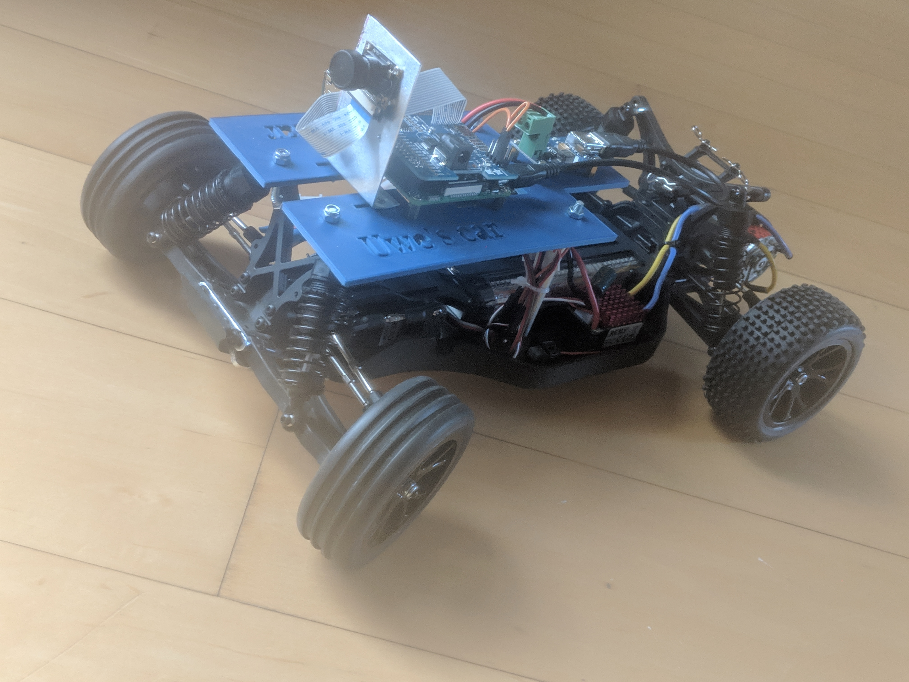
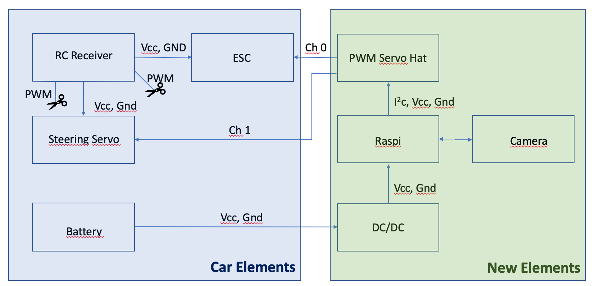
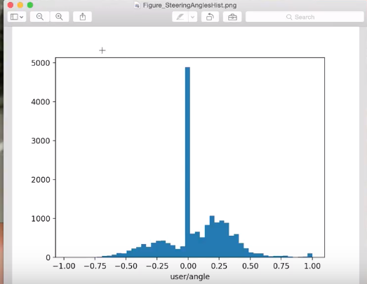

# Change to donkeycar {#donkeyCar}

In December 2018 I switched from sunfounder to donkeycar 
[Donkey Car](http://www.donkeycar.com "Donkey Car's Homepage")

## Reason for changing the plattform
The sunfounder was wonderful to learn the basics, PWM, I2C, use of camera with Pi, but had shortcomings in the steering mechanism. The steering angle was not reproducible, i.e. sending twice the same steering command did result in different steering angles of about a few degrees difference. Now since the aim of the game is to train a neural net which takes the commanded steering angle as ground truth this was a show stopper for me and therefore i moved to => Donkey Car  

Second reason, other members of the group [Esslinger Makerspace Projekt: Autonomen RoboCar bauen](https://www.meetup.com/Esslingen-Makerspace/ "Homepage of the meetup")  opted for donkey car.

### Selecting a RC car

Selection criteria for RC car are:

- Brushed motor => no need for high speed
- NiMH battery => less sensitive to mechanical impact compared to Li-ion battery
- ESC no integrated into remote controll receiver
- 3 wire steering servo


I changed to [Reely Dart 2.0 Brushed](https://www.conrad.de/de/reely-dart-20-brushed-110-rc-modellauto-elektro-buggy-heckantrieb-100-premium-rtr-24-ghz-inkl-akku-ladegeraet-und-s-1605712.html)
Tamiya-Buchse is the connector of the NiMH battery
Charger is [Voltcraft V-Charge Eco NiMh 3000](https://www.voelkner.de/products/873118/VOLTCRAFT-Modellbau-Ladegeraet-230V-3A-V-Charge-Eco-NiMh-3000-NiMH-NiCd.html?ref=43&gclid=Cj0KCQiAoo7gBRDuARIsANeJKUY9VcxYcAKJaeCDBPf9sg6MXEd316L1nYbbPL-Y-BZesMLOi7MQGoYaAuewEALw_wcB)

```{r echo=FALSE, fig.cap="Reely Dart 2.0 Brushed converted RoboCar", message=FALSE, warning=FALSE, fig.height=2, paged.print=FALSE, eval=TRUE}
library(knitr)

```

## What to do

- disassemble the sunfounder, by taking of the plate on which the raspberry is mounted
- disassemble the L298N H-bridge, not needed if you use an [ESC](https://en.wikipedia.org/wiki/Electronic_speed_control) 
- Rewire the PWM signal of the car
    - channel 1 => steering
    - channel 0 => throttle
- [Install Software on Pi and Host Computer](http://docs.donkeycar.com/guide/install_software/#get-the-raspberry-pi-working)
    - Setup Raspberry Pi
    - Setup Mac Host PC (or windows or Linux host)
    
    
- [Calibrate your car](http://docs.donkeycar.com/guide/calibrate/)
- [Drive your car](http://docs.donkeycar.com/guide/get_driving/)
- [Train an autopilot with Keras](http://docs.donkeycar.com/guide/train_autopilot/)
- [http://docs.donkeycar.com/guide/simulator/](http://docs.donkeycar.com/guide/simulator/)

-  Select web or physical controller [Controller Parts](http://docs.donkeycar.com/parts/controllers/#physical-joystick-controller)

## Rewiring the car

The rewiring consists of

- Disconnect the following connections
    - PWM signal RC receiver => Steering Servo
    - PWM signal RC receiver => ESC
    
- Connect
    - Battery => DC/DC converter
    - DC/DC converter => Raspberry Pi
    - PWM Servo Hat onto Raspberry Pi
    - PWM Servo Hat Ch 0 => ESC
    - PWM Servo Hat Ch 1 => Steering Servo
    - Raspberry Pi => Raspberry Pi camera

The resulting wiring diagram can be seen in figure \@ref(fig:wiringDiagram)


```{r wiringDiagram, fig.cap= "Wiring diagram after rewiring car", echo=FALSE, message=FALSE, warning=FALSE, fig.height=2, paged.print=FALSE, eval=TRUE}
library(knitr)

```

So there are only two PWM signal wires from the PWM Servo Hat to the car and the power supply needs to be connected to the DC/DC converter. A close-up on the PWM Servo Hat is given in figure \@ref(fig:closeUpPwmHat) 

```{r closeUpPwmHat, fig.cap= "Close-up of PWM Servo Hat", echo=FALSE, message=FALSE, warning=FALSE, eval=TRUE, dpi= 800}
library(knitr)
include_graphics("images/ServoHat.jpg", dpi = NA)
```


You can elimnate the RC receiver altogether, see figure \@ref(fig:rewireSimple) 

```{r rewireSimple, fig.cap= "Rewiring without RC receiver", echo=FALSE, message=FALSE, warning=FALSE, eval=TRUE, dpi= 800}
library(knitr)
include_graphics("images/RewiringSimple.png", dpi = NA)
```


### Parts list

The following list is what I used to build the car, this does not mean there are better and/or cheaper options available. In total the cost is about 250€.

- [Reely Dart 2.0 Brushed](https://www.conrad.de/de/reely-dart-20-brushed-110-rc-modellauto-elektro-buggy-heckantrieb-100-premium-rtr-24-ghz-inkl-akku-ladegeraet-und-s-1605712.html) ca. 130€
- [Raspberry Pi](https://www.reichelt.de/raspberry-pi-3-b-4x-1-2-ghz-1-gb-ram-wlan-bt-raspberry-pi-3-p164977.html?r=1) ca. 34€
- [Raspbery Pi camera](https://www.amazon.de/dp/B00N1YJKFS/ref=pe_3044161_189395811_TE_dp_1) ca. 25€
- [PWM Servo Hat](https://www.amazon.de/gp/product/B01185WQXY?ref=em_1p_0_ti&ref_=pe_2444481_339394281) ca. 32€
- [DC/DC converter](https://www.reichelt.de/entwicklerboards-spannungsregler-6-40-v-dc-auf-2x-usb-5v-3a-debo-dc-2xusb-p242778.html?PROVID=2788&gclid=CjwKCAiA4OvhBRAjEiwAU2FoJaCWbrXYqhuMADE3wArHLnltplldPHPumAXmfit7bQZUbyxtnIbwhRoCvqAQAvD_BwE&&r=1) ca. 4€, 
- [WiiU controller](https://www.amazon.de/dp/B06XSB2TXQ/ref=pe_3044161_185740101_TE_item) ca. 18€
- [Tamiya Stecker Power wires](https://www.amazon.de/gp/product/B01I1N73TI/ref=ppx_yo_dt_b_asin_title_o04__o00_s00?ie=UTF8&psc=1) ca. 9€

- Stuff to mechanically integrate the new elements into the car.


### Why not using PCA9685 

**Note**, there seems to be an issue with driving two servos with PCA9685 at the same time. What happens is that steering and throttle work during calibration but not when the car is controlled via the web interface. TBC

A possible cure is described at [Adafruit 16 Channel Servo Driver with Raspberry Pi](https://cdn-learn.adafruit.com/downloads/pdf/adafruit-16-channel-servo-driver-with-raspberry-pi.pdf ). 


>When to add an optional Capacitor to the driver board
We have a spot on the PCB for soldering in an electrolytic capacitor. Based on your usage, you may or may not need a
capacitor. If you are driving a lot of servos from a power supply that dips a lot when the servos move, n * 100uF where n is the number of servos is a good place to start - eg 470uF or more for 5 servos. Since its so dependent on servo current draw, the torque on each motor, and what power supply, there is no "one magic capacitor value" we can suggest which is why we don't include a capacitor in the kit.

I did **not** check whether this works.

The now used [PWM SERVO HAT 2327 By ADAFRUIT INDUSTRIES](https://www.amazon.de/gp/product/B01185WQXY?ref=em_1p_0_ti&ref_=pe_2444481_339394281) did not show any problem controlling two channels at the same time


## Folders created during installation of host PC
- /Users/uwesterr/mycar/models
- /Users/uwesterr/mycar/data
- /Users/uwesterr/mycar/logs


## Calibrate the car

Instructions for the calibrations can be found at http://docs.donkeycar.com/guide/calibrate/#calibrate-your-car

ssh into your raspberry 

### Setting WIFI up for the raspberry

To set up the WiFi connection on the raspberry you find a detailed description at 
[SETTING WIFI UP VIA THE COMMAND LINE](https://www.raspberrypi.org/documentation/configuration/wireless/wireless-cli.md "DOCUMENTATION > CONFIGURATION > WIRELESS > WIRELESS-CLI")

### Steering Calibration
To start steering calibration run
```
donkey calibrate --channel <your_steering_channel>
```


PWM channel 1 for steering
```
donkey calibrate --channel 1
```

```
(env) pi@donkeypi_uwe:~ $ donkey calibrate --channel 1
using donkey version: 2.5.8 ...
Enter a PWM setting to test(0-1500)360
Enter a PWM setting to test(0-1500)120     
.
.
.
```

```Ctrl C``` to exit calibration mode  

### Throttle Calibration

To start throttle calibration run
```
donkey calibrate --channel <your_throttle_channel>
```
PWM channel 0 for throttle
```
(env) pi@donkeypi_uwe:~ $ donkey calibrate --channel 0
using donkey version: 2.5.8 ...
Enter a PWM setting to test(0-1500)400
Enter a PWM setting to test(0-1500)420
Enter a PWM setting to test(0-1500)400
Enter a PWM setting to test(0-1500)380
```

### Config.py after calibration {#configpyAfterCalib}
after configuration the ```config.py``` file reads

```
"""
CAR CONFIG

This file is read by your car application's manage.py script to change the car
performance.

EXMAPLE
-----------
import dk
cfg = dk.load_config(config_path='~/mycar/config.py')
print(cfg.CAMERA_RESOLUTION)

"""


import os

#PATHS
CAR_PATH = PACKAGE_PATH = os.path.dirname(os.path.realpath(__file__))
DATA_PATH = os.path.join(CAR_PATH, 'data')
MODELS_PATH = os.path.join(CAR_PATH, 'models')

#VEHICLE
DRIVE_LOOP_HZ = 20
MAX_LOOPS = 100000

#CAMERA
CAMERA_RESOLUTION = (120, 160) #(height, width)
CAMERA_FRAMERATE = DRIVE_LOOP_HZ

#STEERING
STEERING_CHANNEL = 1
STEERING_LEFT_PWM = 460
STEERING_RIGHT_PWM = 370

#THROTTLE
THROTTLE_CHANNEL = 0
THROTTLE_FORWARD_PWM = 550
THROTTLE_STOPPED_PWM = 410
THROTTLE_REVERSE_PWM = 320

#TRAINING
BATCH_SIZE = 128
TRAIN_TEST_SPLIT = 0.8


#JOYSTICK
USE_JOYSTICK_AS_DEFAULT = False
JOYSTICK_MAX_THROTTLE = 0.25
JOYSTICK_STEERING_SCALE = 1.0
AUTO_RECORD_ON_THROTTLE = True


TUB_PATH = os.path.join(CAR_PATH, 'tub') # if using a single tub
```


## Drive your car with web interface

Instructions are at http://docs.donkeycar.com/guide/get_driving/ 

### Preparation on Mac

- open terminal
- Activate mappings to donkey Python setup with: ```source activate donkey```
- Change to your local dir for managing donkey: ```cd ~/mycar```

### Preparation on Raspberry
```
cd ~/mycar
python manage.py drive
```
in the terminal window that looks like follows: 

```
(env) pi@donkeypi_uwe:~/mycar $ python manage.py drive

using donkey version: 2.5.8 ...
/usr/lib/python3/dist-packages/h5py/__init__.py:34: FutureWarning: Conversion of the second argument of issubdtype from `float` to `np.floating` is deprecated. In future, it will be treated as `np.float64 == np.dtype(float).type`.
  from ._conv import register_converters as _register_converters
loading config file: /home/pi/mycar/config.py
config loaded
PiCamera loaded.. .warming camera
Starting Donkey Server...
You can now go to http://127.0.0.1:8887 to drive your car.
/home/pi/env/lib/python3.5/site-packages/picamera/encoders.py:544: PiCameraResolutionRounded: frame size rounded up from 160x120 to 160x128
  width, height, fwidth, fheight)))
```

### Open control in web browser on Mac

You can now control your car from a web browser at the URL: ```192.168.178.67:8887```


## Connecting bluetooth controller

I got an WiiU second hand [WiiU controller](https://www.amazon.de/gp/product/B06XSB2TXQ/ref=oh_aui_detailpage_o01_s00?ie=UTF8&psc=1), therefore I did select the [Controllers page](http://docs.donkeycar.com/parts/controllers/) the [WiiU controller](https://github.com/autorope/donkeypart_bluetooth_game_controller)

After ssh into the raspberry install **Bluetooth Game Controller** library

``` 
git clone https://github.com/autorope/donkeypart_bluetooth_game_controller.git
pip install -e ./donkeypart_bluetooth_game_controller
``` 


### Connect your bluetooth controller to the raspberry pi. {#BluetoothControllerInstall}

1. Start the Bluetooth bash tool on your raspberry pi.

``` 
sudo bluetoothctl
power on
scan on
``` 
2. Turn on your controller in scan mode and look for your controllers name in the bluetoothctl scan results. This is done by turning over the controller and pushing the sync button until the 4 blue buttons blink

In the shell the scan showed 
> [NEW] Device 0C:FC:83:97:A6:4F Nintendo RVL-CNT-01

3. Connect to your controller using its id (my controller id is ```0C:FC:83:97:A6:4F```) once you've found it's id. You may have to run these commands several times.

``` 
 pair 0C:FC:83:97:A6:4F 
 connect 0C:FC:83:97:A6:4F
 trust 0C:FC:83:97:A6:4F
``` 

Now your controller should show that your controller is connected - the 4 blinking lights turns to one solid light.

Run the part script to see if it works. You should see all the button values printed as you press them. Like this.

``` 
cd /donkeypart_bluetooth_game_controller/donkeypart_bluetooth_game_controller
(env) pi@donkeypi_uwe:~/donkeypart_bluetooth_game_controller/donkeypart_bluetooth_game_controller $ python part.py log
Please give a string that can identify the bluetooth device (ie. nintendo)nintendo
log
device /dev/input/event0, name "Nintendo Wii Remote Pro Controller", phys ""
button: LEFT_STICK_X, value:-0.009375
button: LEFT_STICK_X, value:-0.0015625
button: LEFT_STICK_X, value:-0.00390625
button: LEFT_STICK_X, value:-0.00546875
button: LEFT_STICK_X, value:-0.00703125
``` 
How to adde the Bluetooth controller into `manage.py`is described in section \@ref(AddBluetooth)

In the file ```manageOrgExtWii.py``` the Bluetooth controller was integrated.


## Start driving or training

Before start driving it might be a good idea to **limit the max velocity**, this can be done as described in \@ref(setMaxVel)


- Power up donkeycar
- Wait about 10s until Raspberry Pi is booted
- Switch on Bluetooth controller
    - for Nintendo Wii controller
    - the four blue LEDs flash a few times
    - the left most LED solid shows that controller is connected with Raspberry Pi

Once controller is connected proceed as described in [instructions](https://docs.donkeycar.com/guide/get_driving/)

``` 
ssh pi@<your_pi_ip_address>
# or
ssh pi@donkeypi-uwe

cd ~/mycar
python manage.py drive
# or if you have changed the file name to indicate that you added the bluetooth contorller
python manageOrgExtWii.py drive
``` 

how to the the IP address of your car you  check your at your router. How to do this at shackspace is described \@ref(GetIp)


And the car drives

<video width="720" controls>
  <source src="images/firstTryDonkeyCar.mp4" type="video/mp4">
</video>

add Bluetooth controller to ```manage.py``` https://github.com/autorope/donkey2_plus/blob/690ff1b78c49c2a3dd4c1095bfcac9673f150804/manage.py 

### Create movie from tub data
To create a movie from the gathered data
```
donkey makemovie <tub_path> [--out=<tub_movie.mp4>]
# for example create movie tubMovie.mp4 from data located at tub
donkey makemovie --tub tub --out tubMovie.mp4   
```
More details at http://docs.donkeycar.com/utility/donkey/#make-movie-from-tub


### Options of manage.py
The script ```manage.py``` can be called with several options, to find them type 
``` 
(env) pi@donkeypi_uwe:~/mycar $ python manage.py drive --h
``` 
>
using donkey version: 2.5.8 ...
/usr/lib/python3/dist-packages/h5py/__init__.py:34: FutureWarning: Conversion of the second argument of issubdtype from `float` to `np.floating` is deprecated. In future, it will be treated as `np.float64 == np.dtype(float).type`.
  from ._conv import register_converters as _register_converters
Scripts to drive a donkey 2 car and train a model for it.

```
Usage:
    manage.py (drive) [--model=<model>] [--js] [--chaos]
    manage.py (train) [--tub=<tub1,tub2,..tubn>]  (--model=<model>) [--base_model=<base_model>] [--no_cache]

Options:
    -h --help        Show this screen.
    --tub TUBPATHS   List of paths to tubs. Comma separated. Use quotes to use wildcards. ie "~/tubs/*"
    --js             Use physical joystick.
    --chaos          Add periodic random steering when manually driving
```

## Tips on how to drive during training

Here are a few tips on how to gather the necessary training data. The tips are based on a video by Tawn Kramer [Driving Tips to Train your Autonomous End-to-End NN Driver](https://www.youtube.com/watch?v=4fXbDf_QWM4&feature=youtu.be)


- create about 10,000 images
- four different driving modes, more don't hurt
- do some driving to get used to the control
- divide training session into four parts
    - drive slowly precisely center of the lane 
        - about two laps
        - about 10% of the data
    - drive in lane with small oscillations
        - shows NN how track looks like at different angles
        - shows NN how to correct back to center
        - about 2-3 laps
    - drive like you normally drive
        - speed a little bit
        - not always bang center of lane
    - drive with slow oscillations
        - bounce back and forth between extremes of the lanes
        - help NN to establish the lane boundaries

The resulting steering angle histogram is shown in figure \@ref(fig:steeringAngleHist)


```{r steeringAngleHist, fig.cap= "Steering angle histogramm of Tawn Kramer's training data", echo=FALSE, message=FALSE, warning=FALSE, fig.height=2, paged.print=FALSE, eval=TRUE}
library(knitr)

```


- About 50% are straight driving
- Two humps from the oscillating driving
- Right hump more prominent since course has more right bends

### How to edit recorded data
The donkey car utility tubclean is described in chapter \@ref(tubclean)


## Mange recorded data

The training data is being stored in the folder /mycar/tub. 

Since there might be a lot of data after a while you might want to

- delete 
- archive 
- copy it from the Raspberry Pi to your computer

data

### Archiving data
Archiving can be done by renaming the tub folder with the ```mv``` command. The ```mv``` command moves, or renames, files and directories on your file system. To move the **tub** folder, i.e rename it, to **tubArchive** use


```
mv tub tubArchive
```

more details on ```mv``` can be found at https://www.computerhope.com/unix/umv.htm 

### Delete data
Once you want to get rid of the data use the following command

```
rm -rf tub
```

More on ```rm``` can be found at https://www.computerhope.com/unix/urm.htm 


### Copy files from raspi to mac

[copy file from pi to mac](https://www.raspberrypi.org/documentation/remote-access/ssh/scp.md) run in terminal

```
scp pi@192.168.178.67:mycar/manage.py
# or
rsync -r pi@192.168.178.67:~/mycar/tub/  ~/mycar/tub/
```
then type the password of the pi, afterwards the the file ```mycar/manage.py``` is being copied to the current location. The current location can be found via the ```pwd```command.

```
10-42-27-27:CloudProjectsUnderWork uwesterr$ pwd
/Users/uwesterr/CloudProjectsUnderWork 
```

### How big is the tub folder
If you want to know how many MB of data you collected already use the `su` comand. More info on the `su` command [here](https://unix.stackexchange.com/questions/185764/how-do-i-get-the-size-of-a-directory-on-the-command-line)
```
(env) pi@donkeypi_uwe:~/mycar $ du -sh tub
232M	tub
```

# Donkey Command-line Utilities

This chapter is copied from the [donkey car utility doc](https://github.com/autorope/donkeycar/blob/e23f8f1d2478a4d2132cd8b09e27faa00b393ff7/docs/utility/donkey.md)

The `donkey` command is created when you install the donkeycar Python package. This is a Python script that adds some important functionality. The operations here are vehicle independent, and should work on any hardware configuration.

## Create Car

This command creates a new dir which will contain the files needed to run and train your robot.

Usage:
```bash
donkey createcar --path <dir> [--overwrite] [--template <donkey2>]
```

* This command may be run from any dir
* Run on the host computer or the robot
* It uses the `--path` as the destination dir to create. If `.py` files exist there, it will not overwrite them, unless the optional `--overwrite` is used.
* The optional `--template` will specify the template file to start from. For a list of templates, see the `donkeycar/templates` dir

## Find Car

This command attempts to locate your car on the local network using nmap.

Usage:
```bash
donkey findcar
```

* Run on the host computer
* Prints the host computer IP address and the car IP address if found
* Requires the nmap utility:
```bash
sudo apt install nmap
```

## Calibrate Car

This command allows you to manually enter values to interactively set the PWM values and experiment with how your robot responds.
See also [more information.](http://docs.donkeycar.com/guide/calibrate/#calibrate-your-car)

Usage:
```bash
donkey calibrate --channel <0-15 channel id>
```

* Run on the host computer
* Opens the PWM channel specified by `--channel`
* Type integer values to specify PWM values and hit enter
* Hit `Ctrl + C` to exit

## Clean data in Tub

Opens a web server to delete bad data from a tub.

Usage:
```bash
donkey tubclean <folder containing tubs>
```

* Run on pi or host computer.
* Opens the web server to delete bad data.
* Hit `Ctrl + C` to exit


## Make Movie from Tub

This command allows you to create a movie file from the images in a Tub.

Usage:
```bash
donkey makemovie <tub_path> [--out=<tub_movie.mp4>] [--config=<config.py>]
```

* Run on the host computer or the robot
* Uses the image records from `--tub` dir path given
* Creates a movie given by `--out`. Codec is inferred from file extension. Default: `tub_movie.mp4`
* Optional argument to specify a different `config.py` other than default: `config.py`


## Check Tub {#tubclean}

This command allows you to see how many records are contained in any/all tubs. It will also open each record and ensure that the data is readable and intact. If not, it will allow you to remove corrupt records.

Usage:
```bash
donkey tubcheck <tub_path> [--fix]
```

* Run on the host computer or the robot
* It will print summary of record count and channels recorded for each tub
* It will print the records that throw an exception while reading
* The optional `--fix` will delete records that have problems


## Histogram

This command will show a pop-up window showing the histogram of record values in a given tub.


Usage:
```bash
donkey tubhist <tub_path> --rec=<"user/angle">
```

* Run on the host computer

* When the `--tub` is omitted, it will check all tubs in the default data dir


## Plot Predictions

This command allows you plot steering and throttle against predictions coming from a trained model.

Usage:
```bash
donkey tubplot <tub_path> [--model=<model_path>]
```

* This command may be run from `~/mycar` dir
* Run on the host computer
* Will show a pop-up window showing the plot of steering values in a given tub compared to NN predictions from the trained model
* When the `--tub` is omitted, it will check all tubs in the default data dir


## Simulation Server

This command allows you serve steering and throttle controls to a simulated vehicle using the [Donkey Simulator](/guide/simulator.md).

Usage:
```bash
donkey sim --model=<model_path> [--type=<linear|categorical>] [--top_speed=<speed>] [--config=<config.py>]
```

* This command may be run from `~/mycar` dir
* Run on the host computer
* Uses the model to make predictions based on images and telemetry from the simulator
* `--type` can specify whether the model needs angle output to be treated as categorical
* Top speed can be modified to ascertain stability at different goal speeds


