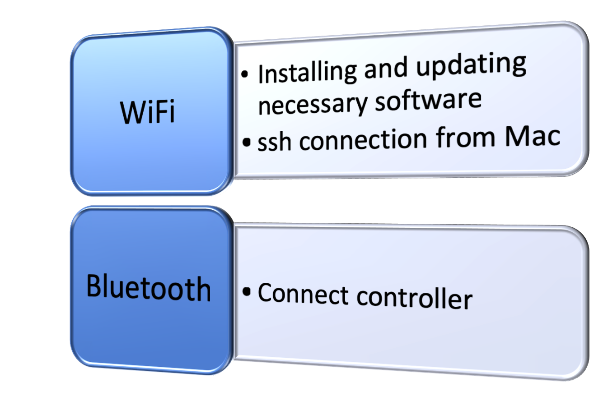
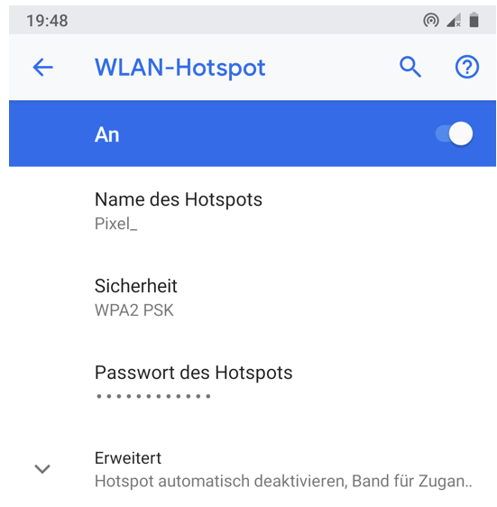
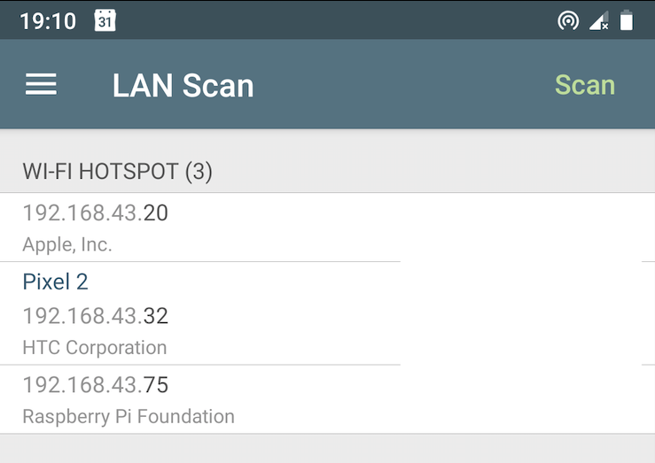

# Wireless connections Raspi, Controller, Mac {#Conncectivity}

Donkeycar needs to communicate to other devices for several purposes using different connections. In this chapter the purpose and the setting up of the  wireless connections of the donkeycar, i.e. Raspberry Pi are described.

An overview of the necessary connection are shown in figure \@ref(fig:connectOverview) 

```{r connectOverview, fig.cap= "Setting up wifi hotspot on Android phone (Pixel 2)", echo=FALSE, message=FALSE, warning=FALSE, fig.height=2, paged.print=FALSE, eval=TRUE}
library(knitr)

```


## Purpose of connections

The connections serve different needs which are as follows:

- Raspi Wifi
    - installing and updating necessary software
    - for ssh connection from Mac
        - start python scripts
        - transfer training data to Mac
        - transfer trained model from Mac
        
        
- Raspi Bluetooth
    - Connect controller
        - Steering
        - Throttle
        - Switching recording of images ON/OFF
        - Switching control user mode
            - car is controlled by controller => user
            - steering is controlled by neural net
            - steering and throttle are controlled by neural net
            
            
## Setting up of the wireless connections

In this section the setting up of the wireless connections is described. Special focus is set on the having an independent setup where the user is not dependent on external wifi provider. This enables the user to gather trainings data on any track without the need to find a wifi connection and the assigned Raspberry Pi IP-adress

### Bluetooth connection

The bluetooth connection is described in [official donkeycar documentation](http://docs.donkeycar.com/parts/controllers/) and for the WiiU controller in chapter \@ref(BluetoothControllerInstall).  

Quite a few people reported problems with connecting the controller when not using original WiiU or PS3 controller.


### Wifi connection

Since the wifi connection is useful to ssh into the Raspberry Pi to edit and start python scripts and move data to and from the Raspberry Pi it is helpful if the wifi connection is independent of wifi provided at a track. Therefore a setup with an Android phone (Pixel 2) is described which can be setup anywhere.

#### Enable wifi on Raspberry Pi

At https://www.raspberrypi.org/documentation/configuration/wireless/wireless-cli.md a description on


- enable wifi
- scannig for available wifi
- adding network details


#### Setting up wifi hotspot (Android phone)

Using a mobil phone as wifi hotspot enables independent operation of the donkeycar. In figure \@ref(fig:WifiHotspot) a screen shot of the wifi hotspot menu is shown.

```{r WifiHotspot, fig.cap= "Setting up wifi hotspot on Android phone (Pixel 2)", echo=FALSE, message=FALSE, warning=FALSE, fig.height=2, paged.print=FALSE, eval=TRUE}
library(knitr)

```


The Raspberry Pi IP-adress can be found using a app called [Network Analyzer](https://play.google.com/store/apps/details?id=net.techet.netanalyzerlite.an&hl=en)

```{r LanScan, fig.cap= "Network Analyzer LAN scanning result", echo=FALSE, message=FALSE, warning=FALSE, fig.height=2, paged.print=FALSE, eval=TRUE}
library(knitr)

```

Now the Raspberry Pi can be reached from the Mac using the IP-adress `192.168.43.75`. In a terminal on the Mac ssh connection and file transfers can be done.

```
#open ssh connection to Raspberry Pi
 ssh pi@192.168.43.75
# copy files from Raspberry Pi to Mac  
 rsync -r pi@192.168.43.75:~/mycar/tub/  ~/mycar/tubMac/

```

#### Get IP adress of raspi in shack {#GetIpShack}

If connected to a provided wifi network the Raspberry Pi IP adress needs to be found out.
Check in the router for the IP adress, procedure is dependent on router
At shackspace go to http://leases.shack/#/ (only available from the shackspace network)

and then connect via ssh pi@ipAdress 

if you get 
```
Uwes-MBP:data uwesterr$ ssh pi@10.42.26.33
@@@@@@@@@@@@@@@@@@@@@@@@@@@@@@@@@@@@@@@@@@@@@@@@@@@@@@@@@@@
@    WARNING: REMOTE HOST IDENTIFICATION HAS CHANGED!     @
@@@@@@@@@@@@@@@@@@@@@@@@@@@@@@@@@@@@@@@@@@@@@@@@@@@@@@@@@@@
IT IS POSSIBLE THAT SOMEONE IS DOING SOMETHING NASTY!
Someone could be eavesdropping on you right now (man-in-the-middle attack)!
It is also possible that a host key has just been changed.
The fingerprint for the ECDSA key sent by the remote host is
SHA256:aYMRAzv3GpxqJNugz1oTi20m0QKVIVfVxszQkJNbNqg.
Please contact your system administrator.
Add correct host key in /Users/uwesterr/.ssh/known_hosts to get rid of this message.
Offending ECDSA key in /Users/uwesterr/.ssh/known_hosts:20
ECDSA host key for 10.42.26.33 has changed and you have requested strict checking.
Host key verification failed.
```

then you have to remove the cached key for donkeypi-uwe (or the old IP adress) on the local machine:

```
ssh-keygen -R donkeypi-uwe
```

