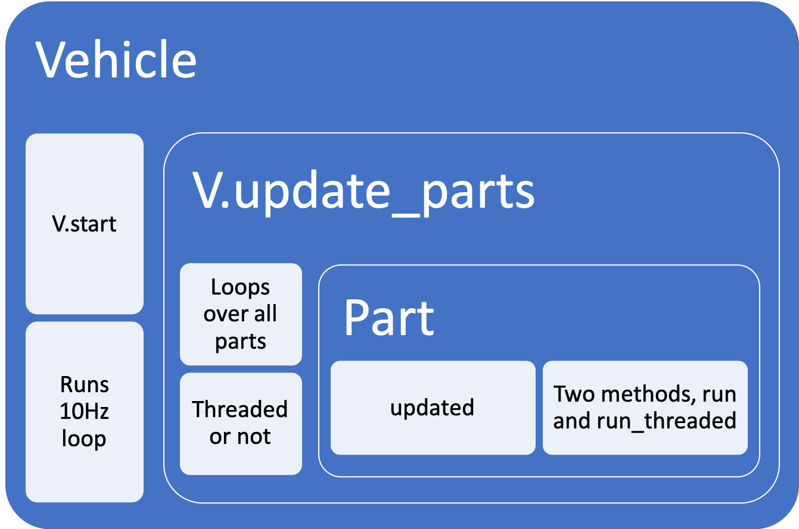
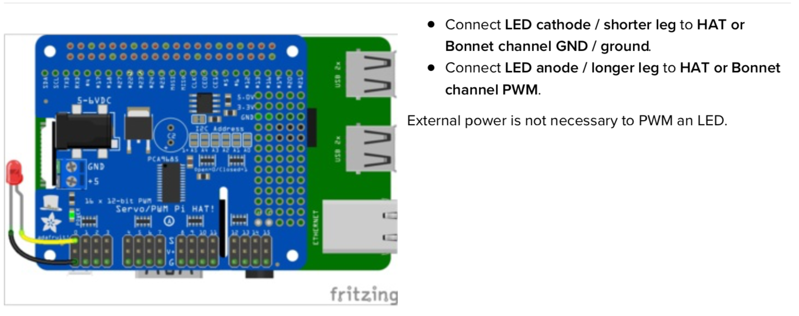

# Donkeycar software analysis {#donkeyCarSoftwareAnalysis}
In this section the software of the donkeycar project is analysed with emphasis of how to use the software to gather training data and to modify the Keras model


## How to add parts to a vehicle
Two brilliant videos by Tawn Kramer describe the Donkeycar framework. The [first part](https://www.youtube.com/watch?v=YZ4ESrtfShs) describes in detail how to add a part to the vehicle.
In short, a part will be added to the vehicle class and for each iteration of the loop the **run** or the **run_threaded** method of the added class will be executed.

The stacking of the methods are shown in figure \@ref(fig:vehicleCalls)

```{r vehicleCalls, fig.cap= "Stacking of methods", echo=FALSE, message=FALSE, warning=FALSE, fig.height=2, paged.print=FALSE, eval=TRUE}
library(knitr)

```

with
```
from donkeycar.vehicle import Vehicle
```
the Vehicle class is available and is instantiated by
```
V = Vehicle()
```
### Function V.start() 

To start vehicle's main drive loop. 

```
V.start()
```
This is the main thread of the vehicle. It starts all the new threads for the threaded parts then starts an infinite loop that runs each part and updates the memory.

A Vehicle has

- memory
- parts
- threads
- Boolean flag "ON"

#### Parameters of V.start()
The parameters for ```V.start()``` are   

- rate_hz : int (default = 10Hz) 
    - The max frequency that the drive loop should run. The actual frequency may be less than this if there are many blocking parts.   

- max_loop_count : int  (default = None)
    - Maximum number of loops the drive loop should execute. This is used for testing the all the parts of the vehicle work.


#### Main run loop of V.start()
The main run loop of the V.start() function is below. The sleep_time assures that the loop rate is achieved. This can only be guaranteed if the update process duration of the parts does not exceed the loop time.

```
           loop_count = 0
            while self.on:
                start_time = time.time()
                loop_count += 1

                self.update_parts()

                # stop drive loop if loop_count exceeds max_loopcount
                if max_loop_count and loop_count > max_loop_count:
                    self.on = False

                sleep_time = 1.0 / rate_hz - (time.time() - start_time)
                if sleep_time > 0.0:
                    time.sleep(sleep_time)
```

### Function V.update_parts() 

In the ```V.update_parts()``` function the appropriate run function of part are being called.

#### Parameters of V.parts()
There are no parameters

#### Loop over all parts
The following code will be looped over for all parts

```
        for entry in self.parts:
            # don't run if there is a run condition that is False
            run = True
            if entry.get('run_condition'):
                run_condition = entry.get('run_condition')
                run = self.mem.get([run_condition])[0]
                # print('run_condition', entry['part'], entry.get('run_condition'), run)

            if run:
                p = entry['part']
                # get inputs from memory
                inputs = self.mem.get(entry['inputs'])

                # run the part
                if entry.get('thread'):
                    outputs = p.run_threaded(*inputs)
                else:
                    outputs = p.run(*inputs)

                # save the output to memory
                if outputs is not None:
                    self.mem.put(entry['outputs'], outputs)
```
It checks whether the part has inputs and passes the input to 

- ```p.run_threaded``` if the part is threaded
- ``p.run`` if the part is not threaded

If there are outputs the are passed to the output of the part using the name of the keys supplied by the call. The names of the inputs and outputs are defined when the parts are added via the ```V.add()```function

### Function V.add
Method to add a part to the vehicle drive loop. The names of parts in- and outputs are defined by the parameters of the ```V.add```function

#### Parameters of V.add()

- inputs : list
    - Channel names to get from memory.
- outputs : list
    - Channel names to save to memory.
- threaded : Boolean
    - If a part should be run in a separate thread.
- run_condition: Boolean
    - If a part should be run at all.

#### Example to add Web controller
The web controller is first instantiated and then added using the ```V.add()```function. The names of in- and outputs are supplied as well as the indicator that the controller is threaded. More on threaded parts in section \@ref(threadedParts)

```
ctr = LocalWebController(use_chaos=use_chaos)
V.add(ctr,
      inputs=['cam/image_array'],
      outputs=['user/angle', 'user/throttle', 'user/mode', 'recording'],
      threaded=True)
```

#### Example add Bluetooth Controller {#AddBluetooth}

To add a Bluetooth controller add the following lines to `manage.py` in the `drive` method

```
from donkeypart_bluetooth_game_controller import BluetoothGameController
   ctl = BluetoothGameController()
    V.add(ctl,
          inputs=['cam/image_array'],
          outputs=['user/angle', 'user/throttle', 'user/mode', 'recording'],
          threaded=True) 
```


### Concept of threads vs non-threaded parts {#threadedParts}

Updating of the parts is run in the loop of the ```V.update()```. To avoid that parts which take long to update blocks the loop they can be assigned to a dedicated thread. Whenever the a threaded part is updated the ```run_threaded```method is run. For a camera the  ```run_threaded``` is

```
def run_threaded(self):
    return self.frame
```
which returns the frame available at the time, no delay being imposed on the loop.


#### The ```update``` function
Images are taken constantly as fast as possible by the method ```update``` as shown below

```
def update(self):
    # keep looping infinitely until the thread is stopped
    for f in self.stream:
        # grab the frame from the stream and clear the stream in
        # preparation for the next frame
        self.frame = f.array
        self.rawCapture.truncate(0)
        # if the thread indicator variable is set, stop the thread
        if not self.on:
            break
```

#### The ```shutdown``` function

To stop the thread a ```shutdown```function needs to be defined  
```
def shutdown(self):
    # indicate that the thread should be stopped
    self.on = False
    print('stoping PiCamera')
    time.sleep(.5)
    self.stream.close()
    self.rawCapture.close()
    self.camera.close()
```

## Structure of ```manage.py```
 ```manage.py``` contains scripts to drive a donkey 2 car and train a model for it.


The structure of ```manage.py```is well explained by Tawn Kramer in [Donkeycar Parts Overview Pt 2/2](https://www.youtube.com/watch?v=G1JjAw_NdnE)  

### Creating ```manage.py```

```manage.py```is created when the command ```donkey createcar --path ~/d2``` is run and is a copy of ```/templates/donkey2.py```
If you want to add other templates this can be done by adding the name of the template without the extension ".py".

```donkey createcar --path ~/d2 --template tk``` 
Then ```tk.py```will be copied into ```manage.py```

### Starting  ```manage.py```
In order to start ```manage.py``` without the need to write **pyhton**

```
chmode +x manage.py
./manage.py
```

The line

```
#!/usr/bin/env python3
```
makes sure that the script is run with pyhton3.

### Parsing the command line parameters
docopt is a Command-line interface description language with which the following options are parsed.


The parsed inputs are then used by
```
if __name__ == '__main__':
    args = docopt(__doc__)
    cfg = dk.load_config()

    if args['drive']:
        drive(cfg, model_path=args['--model'], use_chaos=args['--chaos'])

    elif args['train']:
        tub = args['--tub']
        new_model_path = args['--model']
        base_model_path = args['--base_model']
        cache = not args['--no_cache']
        train(cfg, tub, new_model_path, base_model_path)

```
Note, the ```if __name__ == '__main__':``` part is only run if the code is called as first script.

The ```__doc__``` string is the text block at the beginning of the script.
Parameters in () are mandatory, parameters in [ ] are optional.
```
Usage:
    manage.py (drive) [--model=<model>] [--js] [--chaos]
    manage.py (train) [--tub=<tub1,tub2,..tubn>]  (--model=<model>) [--base_model=<base_model>] [--no_cache]

Options:
    -h --help        Show this screen.
    --tub TUBPATHS   List of paths to tubs. Comma separated. Use quotes to use wildcards. ie "~/tubs/*"
    --chaos          Add periodic random steering when manually driving
```

### Function ```drive```

Construct a working robotic vehicle from many parts. Each part runs as a job in the Vehicle loop, calling either it's **run** or **run_threaded** method depending on the constructor flag `threaded`. All parts are updated one after another at the frame rate given in cfg.DRIVE_LOOP_HZ assuming each part finishes processing in a timely manner.  

Parts may have named outputs and inputs. The framework handles passing named outputs to parts requesting the same named input.


#### Lambda class {#LambdaClass}

Lambda wraps a function into a donkey part, i.e. it will be called for every update loop.  
```
class Lambda:
    """
    Wraps a function into a donkey part.
    """
    def __init__(self, f):
        """
        Accepts the function to use.
        """
        self.f = f

    def run(self, *args, **kwargs):
        return self.f(*args, **kwargs)

    def shutdown(self):
        return
```

The function is defined as usual put then  

- apply `Lambda`to defined function
- V.add output of `Lambda`

```
# See if we should even run the pilot module.
# This is only needed because the part run_condition only accepts boolean
def pilot_condition(mode):
    if mode == 'user':
        return False
    else:
        return True

pilot_condition_part = Lambda(pilot_condition)
V.add(pilot_condition_part,
      inputs=['user/mode'],
      outputs=['run_pilot'])
```
The output `run_pilot`is used to define whether or not `kl`is run.

```
V.add(kl,
      inputs=['cam/image_array'],
      outputs=['pilot/angle', 'pilot/throttle'],
      run_condition='run_pilot')
```          


## Locate modules on raspi which are being imported by manage.py

Where on the Raspberry Pi are the modules located which are being imported by the python script ```manage.py```

```
from docopt import docopt

import donkeycar as dk
from donkeycar.parts.camera import PiCamera
from donkeycar.parts.transform import Lambda
from donkeycar.parts.keras import KerasLinear
from donkeycar.parts.actuator import PCA9685, PWMSteering, PWMThrottle
from donkeycar.parts.datastore import TubGroup, TubWriter
from donkeycar.parts.web_controller import LocalWebController
from donkeycar.parts.clock import Timestamp
from donkeypart_bluetooth_game_controller import BluetoothGameController
```

donkeycar is found at the raspi

```
(env) pi@donkeypi_uwe:~ $ find . -name donkeycar
./env/lib/python3.5/site-packages/donkeycar
```
the contents of this folder is shown below
```
(env) pi@donkeypi_uwe:~ $ cd ./env/lib/python3.5/site-packages/donkeycar
(env) pi@donkeypi_uwe:~/env/lib/python3.5/site-packages/donkeycar $ ls
config.py  __init__.py  log.py  management  memory.py  parts  __pycache__  templates  tests  util  vehicle.py
```
which are the same files and folders which are located at the [official GitHub page of DonkeyCar project](https://github.com/autorope/donkeycar/tree/dev/donkeycar)

The donkeypart_bluetooth_game_controller was installed during the set up of the raspi for the project as described in section \@ref(BluetoothControllerInstall)

## Assignment of WiiU controller sticks to action {#AssignStickToAction}

The mapping from button codes to button names is defined in ```donkeypart_bluetooth_game_controller/wiiu_config.yml```

```

device_search_term: 'nintendo'


#Map the button codes to the button names
button_map:
  305: 'A'
  304: 'B'
  307: 'X'
  308: 'Y'
  312: 'LEFT_BOTTOM_TRIGGER'
  310: 'LEFT_TOP_TRIGGER'
  313: 'RIGHT_BOTTOM_TRIGGER'
  311: 'RIGHT_TOP_TRIGGER'
  317: 'LEFT_STICK_PRESS'
  318: 'RIGHT_STICK_PRESS'
  314: 'SELECT'
  315: 'START'
  0: 'LEFT_STICK_X'
  1: 'LEFT_STICK_Y'
  3: 'RIGHT_STICK_X'
  4: 'RIGHT_STICK_Y'
  547: 'PAD_RIGHT'
  546: 'PAD_LEFT'
  544: 'PAD_UP'
  548: 'PAD_DOWN'


joystic_max_value: 1280
```

which is then used in ```donkeypart_bluetooth_game_controller/part.py```

In the class definition BluetoothGameController

```
def __init__(self, event_input_device=None, config_path=None, device_search_term=None, verbose=False):
.  
.  
.  
        self.func_map = {
            'LEFT_STICK_X': self.update_angle,
            'LEFT_STICK_Y': self.update_throttle,
            'B': self.toggle_recording,
            'A': self.toggle_drive_mode,
            'PAD_UP': self.increment_throttle_scale,
            'PAD_DOWN': self.decrement_throttle_scale,
        }
```        
It seems to be odd to have steering and throttle on one stick, to assign throttle to the right stick change ```donkeypart_bluetooth_game_controller/part.py``` to

```
  self.func_map = {
            'LEFT_STICK_X': self.update_angle,
            'RIGHT_STICK_Y': self.update_throttle,
```

to make the controller more sensitive it might be a good idea to limit the max joystick value in ```donkeypart_bluetooth_game_controller/wiiu_config.yml``` to the max value needed which is according to \@ref(configpyAfterCalib) 

## Limit max velocity {#setMaxVel}
To avoid that the car becomes too fast change in ```manage.py``` the **max_pulse** value. Note, the value is dependent of your **cfg.THROTTLE_STOPPED_PWM**, the **max_pulse** value ought to be a bit higher than the **cfg.THROTTLE_STOPPED_PWM**. You might want to find out a suitable value by using the calibration mode which you used to find the max values.


```
    throttle = PWMThrottle(controller=throttle_controller,
                           max_pulse=cfg.THROTTLE_FORWARD_PWM,
                           zero_pulse=cfg.THROTTLE_STOPPED_PWM,
                           min_pulse=cfg.THROTTLE_REVERSE_PWM)
```

to

```
    throttle = PWMThrottle(controller=throttle_controller,
                           max_pulse= 409, # cfg.THROTTLE_FORWARD_PWM, limit forward speed
                           zero_pulse=cfg.THROTTLE_STOPPED_PWM,
                           min_pulse= 380) #  cfg.THROTTLE_REVERSE_PWM) Limit reverse speed
```                           

Or you can set in ```config.py``` the variable **THROTTLE_FORWARD_PWM** which defines the max throttle value to a value which gives you a low enough speed to master the track.

```
THROTTLE_FORWARD_PWM = 413
```


## Add LED to indicate recording mode {#LedIndicatingRecordingMode}
Recording of images can be activated pressing button "B" on the Wii controller. Assignment of buttons to actions can be found at \@ref(AssignStickToAction).

To indicate if recording is active a LED can be used. A function can be added to the update loop of the vehicle class using the lambda class \@ref(LambdaClass). 
Channel 0 and 1 are already taken, channel 3 is available. So the LED controller channel can be set by
```
Led_controller = PCA9685(3)
```
The function and wrapping it by the lambda class is below
```

    # Switch LED depending on recording video or not.
    def led_switch(recording):
        Led_controller.set_pulse(4095*recording)
        
        return 

    led_switch_part = Lambda(led_switch)
    V.add(led_switch_part,
          inputs=['recording'],
          outputs=[])
```

### Wiring of LED to PWM/Servo HAT

How to wire the LED to the PWM/Servo hat is shown in \@ref(fig:LedPwmWiring)


```{r LedPwmWiring, fig.cap= "Wiring diagram of LED to PWM/Servo hat", echo=FALSE, message=FALSE, warning=FALSE, fig.height=2, paged.print=FALSE, eval=TRUE}
library(knitr)

```

Note: you don't need to use a resistor to limit current through the LED as the HAT and Bonnet will limit the current to around 10mA.

More details on how to connect the LED are given in (https://cdn-learn.adafruit.com/downloads/pdf/adafruit-16-channel-pwm-servo-hat-for-raspberry-pi.pdf) in chapter "Python Wiring"


## Change default recording status to false

To avoid unnecessary images in the tub folder the default `recording` status is set to `false`by changing in the file

```
~/donkeypart_bluetooth_game_controller/donkeypart_bluetooth_game_controller/part.py 
```
using the editor nano

```
 nano part.py
```

the line


```        
        self.recording_toggle = cycle([True, False])
```

to


```
        self.recording_toggle = cycle([False, True])
```

so the cycle starts with `False` and can be toggled by pressing the button **B** on the Wii U controller. How to indicate the recording mode with an LED is described in \@ref(LedIndicatingRecordingMode)     