# Installation of Tawn Kramers donkeycar version (By Rainer Bareiß)

following Tawn Kramer
https://github.com/tawnkramer/donkey/blob/master/docs/guide/install_software.md

## Environment
```
1. conda create --name donkey_3tk4 tensorflow-gpu==1.10.0
2. source activate donkey_3tk4
3. git clone https://github.com/tawnkramer/donkey.git
4. pip install -e ./donkey
5. conda install -c conda-forge keras==2.2.2

activate: source activate donkey_3tk4
get installed software: conda env export > environment.yml 
```
content of [environment.yml](https://github.com/Heavy02011/50-donkey/blob/master/environment.yml)

## sudo raspi-config 

```
a. generate DE locales 
b. set german keyboard layout 
c. enable i2c, spi 
d. expand SDcard 
e. set hostname = siliconpi2 
``` 

## etc/wpa_supllicant/wpa_supplicant.conf 

```
a. setup SSID & password 
b. (env) pi@siliconpi2:/etc/wpa_supplicant $ sudo more wpa_supplicant.conf 

country=US 
ctrl_interface=DIR=/var/run/wpa_supplicant GROUP=netdev 
update_config=1 

network={ 
    ssid="XXXXXXXXXXX" 
    psk="dontstorepasswords" 
    id_str="home" 
} 

network={ 
    ssid="shack" 
    psk="welcome2shack" 
    id_str="shack" 
} 
```
 
## installs 

```
a. sudo apt-get install vim 
b. sudo apt-get upgrade 
c. sudo apt-get update 
d. sudo rpi-update 
```

## install donkey on pi 

follow: https://github.com/tawnkramer/donkey/blob/master/docs/guide/install_software.md 


## 5. config.piy 

```
#STEERING 
STEERING_CHANNEL = 1 
STEERING_LEFT_PWM = 480 #500 #420 
STEERING_RIGHT_PWM = 290 #360 

#THROTTLE 
THROTTLE_CHANNEL = 0 
THROTTLE_FORWARD_PWM = 500 #400 
THROTTLE_STOPPED_PWM = 360 
THROTTLE_REVERSE_PWM = 310 
```


## bluetooth 
```
sudo bluetoothctl  
agent on 
power on 
scan on 

connect <Mac> 
trust <Mac> 
```
 

## 8. wii u controller 

setup joystick: https://github.com/tawnkramer/donkey/blob/master/docs/parts/controllers.md#physical-joystick-controller 
 

## autostart donkeycar 

https://gist.github.com/r7vme/9159c52ec72660d8ace02793a5cee788 

```
# Allows to automatically start donkey car on boot.
#
# 1. Put contents to /etc/systemd/system/donkey.service
# 2. sudo systemctl daemon-reload
# 3. sudo systemctl start donkey
# 4. sudo journactl -u donkey
#
# TIP: Grab logs via ssh with 
# 
# ssh pi@d2.local "sudo journalctl -u donkey -f"
#
[Unit]
Description=Donkey car 

[Service]
Restart=always
ExecStart=/bin/su - pi bash -c "python -u d2/manage.py drive --model /home/pi/d2/models/mypilot"

[Install]
WantedBy=multi-user.target
```

## Steering Calibration
```
Make sure your car is off the ground to prevent a runaway situation.
1. Turn on your car.
2. Find the servo cable on your car and see what channel it's plugged into the PCA board. It should be 1 or 0.
3. Run donkey calibrate --channel <your_steering_channel>
4. Enter 360 and you should see the wheels on your car move slightly. If not enter 400 or 300.
5. Next enter values +/- 10 from your starting value to find the PWM setting that makes your car turn all the way left and all the way right. Remember these values.
6. Enter these values in config.py script as STEERING_RIGHT_PWM and STEERING_LEFT_PWM.

LEFT =500
RIGHT = 290
```

## drive 

```
siliconpi2:
cd d2
python manage.py drive 
```

# Driving & Training  following Tawn Kramer (By Rainer Bareiß)

following Tawn Kramer
https://github.com/tawnkramer/donkey/blob/master/docs/guide/get_driving.md

## Environment
```
activate: source activate donkey_3tk4
get installed software: conda env export > environment.yml 
```
content of [environment.yml](https://github.com/Heavy02011/50-donkey/blob/master/environment.yml)

## Read data from pi 
```
(carnd-tf16) rainer@neuron:/media/rainer/_data/20-data/M3-robocar_training/20190112-Shackspace/raw$ 
rsync -r pi@siliconpi1:~/20190112-tub-shack/tub? . 
```

## Check data raw & prepared 
```
(donkey_3tk4) rainer@neuron:/media/rainer/_data/20-data/M3-robocar_training/20190112-Shackspace$ donkey 
tubcheck raw/tub1 raw/tub2 raw/tub3 raw/tub4 `
(carnd-tf16) rainer@neuron:/media/rainer/_data/20-data/M3-robocar_training/20190223-Shackspace$ 
donkey tubcheck tub*
```

## 3. Clean data 
```
(carnd-tf16) rainer@neuron:/media/rainer/_data/20-data/M3-robocar_training$ 
donkey tubclean 20190223-Shackspace/
using donkey version: 2.5.7 ...
Listening on 8886...
```


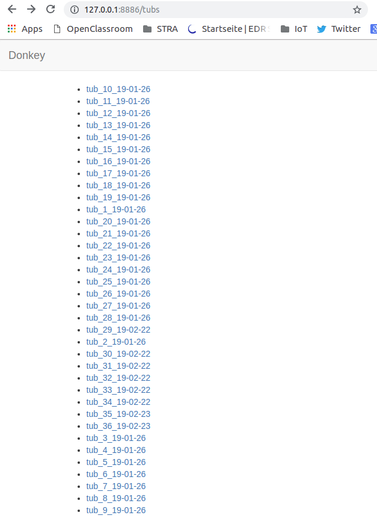
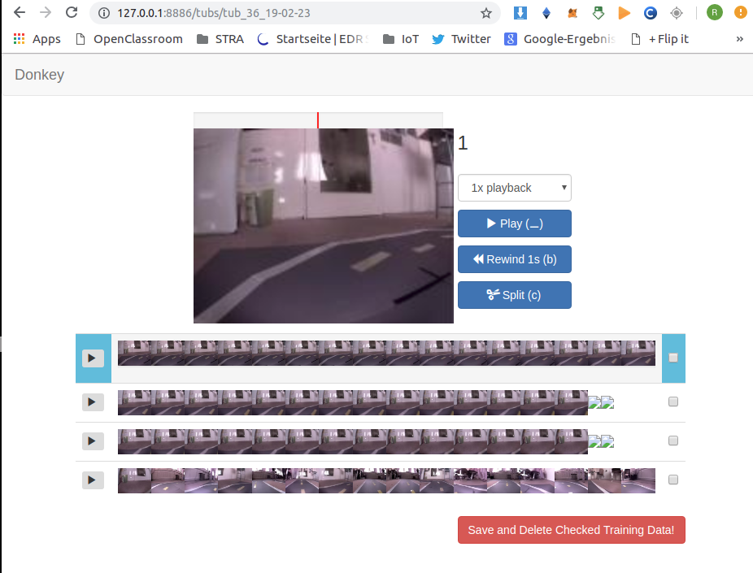
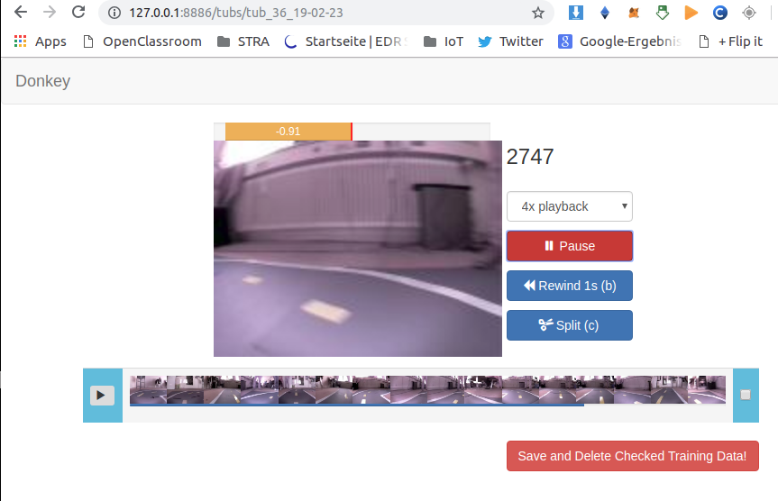

## Make movie 
```
(carnd-tf16) rainer@neuron:/media/rainer/_data/20-data/M3-robocar_training/20190112-Shackspace$ 
donkey makemovie --tub=raw/tub1 --config=raw/config.py --out=tub1.mp4 

(carnd-tf16) rainer@neuron:/media/rainer/_data/20-data/M3-robocar_training/20190223-Shackspace$
scp pi@siliconpi2:~/d2/config.py .
donkey makemovie --tub=raw/tub_36_19-02-23 --config=config.py --out=tub_36_19-02-23.mp4
```

## tubhist 
```
(donkey_3tk4) rainer@neuron:~/dev/25-donkey_3tk$ 
donkey tubhist \
--tub /media/rainer/_data/20-data/M3-robocar_training/20190112-Shackspace/prepared/*
```

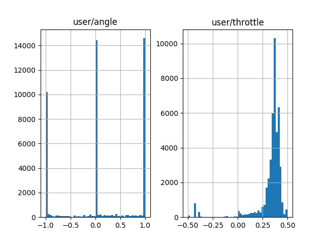

```
(donkey_3tk4) rainer@neuron:~/dev/25-donkey_3tk$ 
donkey tubhist \
--tub /media/rainer/_data/20-data/M3-robocar_training/20190126-TawnKramer/combined_donkey_tub_data/* 
```

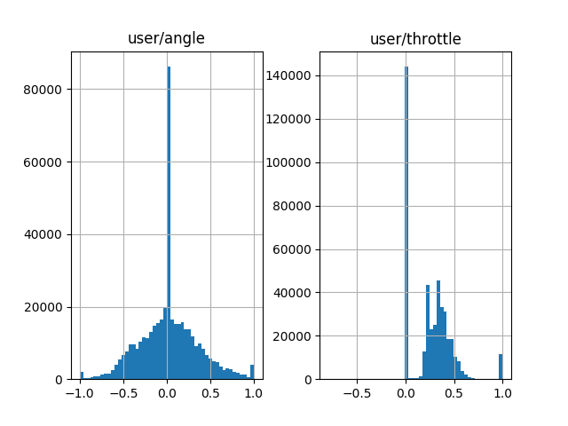

```
(donkey_3tk4) rainer@neuron:/media/rainer/_data/20-data/M3-robocar_training/20190223-Shackspace$ 
donkey tubhist --tub prepared/*
```
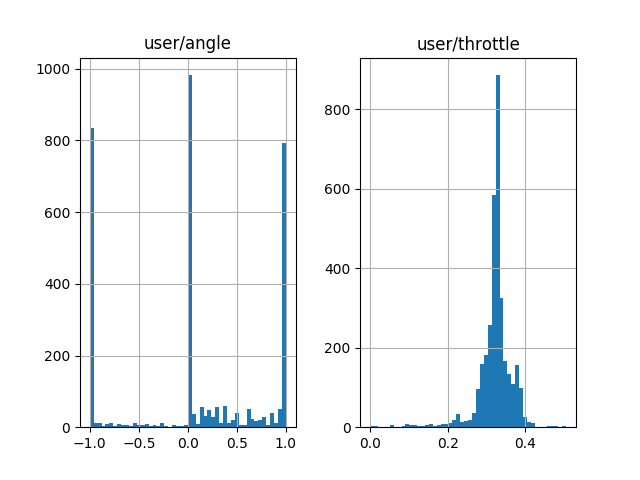


## Train Data

```(donkey_3tk4) rainer@neuron:~/dev/25-donkey_3tk/mycar/$ 
python manage.py train \
       --tub=/media/rainer/_data/20-data/M3-robocar_training/20190112-Shackspace/prepared/* \
       --model=/home/rainer/dev/25-donkey_3tk/mycar/models/shack1.h5 
```

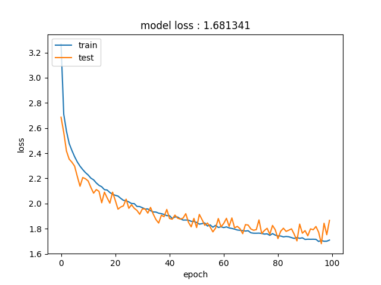

```
(donkey_3tk4) rainer@neuron:~/dev/25-donkey_3tk/mycar$ 
python train.py \
       --tub=/media/rainer/_data/20-data/M3-robocar_training/20190223-Shackspace/prepared/* \
       --model=/home/rainer/dev/25-donkey_3tk/mycar/models/shack2.h5
```
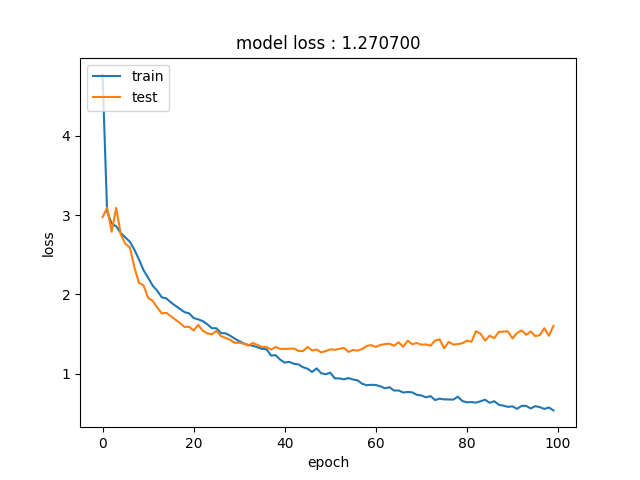

Attention: What happened during training above? Hint, mind the accuracy of testing data.

## Plot data against model 
```
cd (donkey_3tk4) rainer@neuron:~/dev/25-donkey_3tk/mycar
donkey tubplot \
--tub=/media/rainer/_data/20-data/M3-robocar_training/20190112-Shackspace/prepared/tub2_c \
--model=/home/rainer/dev/25-donkey_3tk/mycar/models/shack1.h5 
```


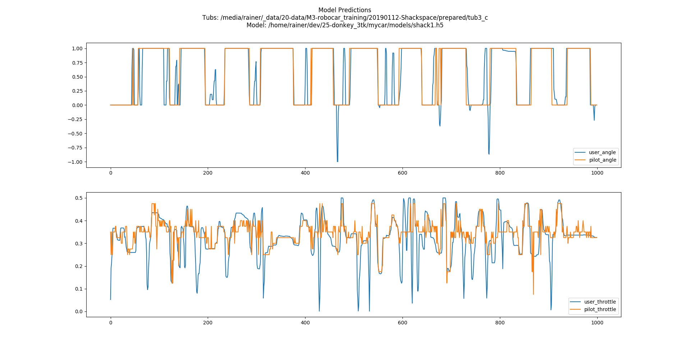

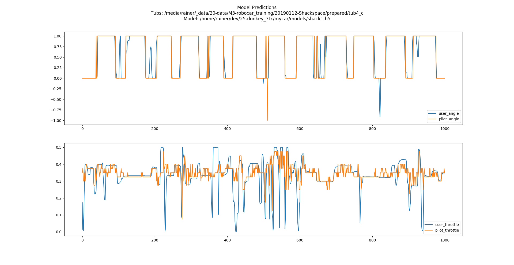

```
(donkey_3tk4) rainer@neuron:~/dev/25-donkey_3tk/mycar$ 
donkey tubplot \
       --tub=/media/rainer/_data/20-data/M3-robocar_training/20190112-Shackspace/prepared/tub4_c \
       --model=/home/rainer/dev/25-donkey_3tk/mycar/models/shack2.h5 
```
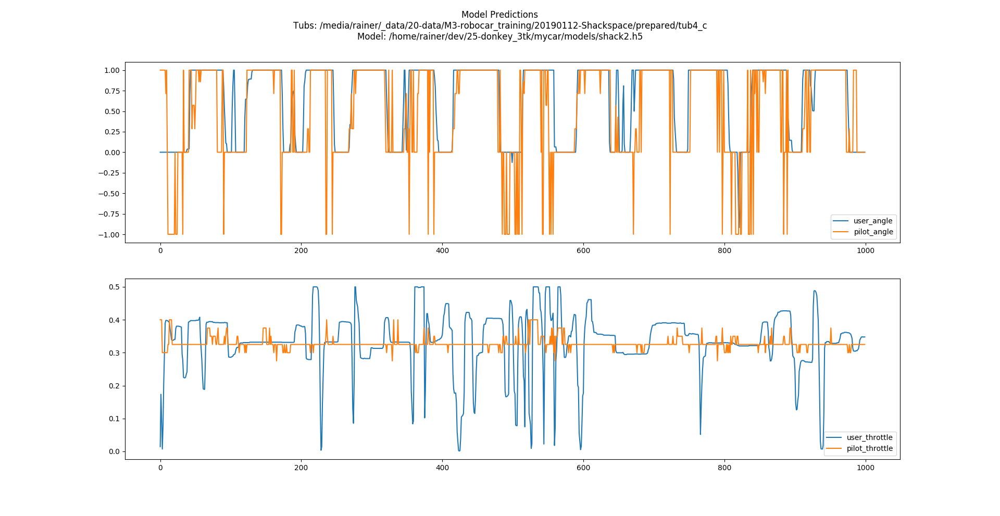

## Run in simulator 
```
(donkey_3tk4) rainer@neuron:~/dev/25-donkey_3tk/donkey_gym/examples/supervised_learning$ 
# python evaluate.py --model /home/rainer/dev/25-donkey_3tk/mycar/models/tawn_shark_cl.h5 
python evaluate.py --model /home/rainer/dev/25-donkey_3tk/mycar/models/shack1.h5 
(donkey_3tk4) rainer@neuron:~/dev/25-donkey_3tk/DonkeySimLinux$ ./donkey_sim.x86_64  
```
[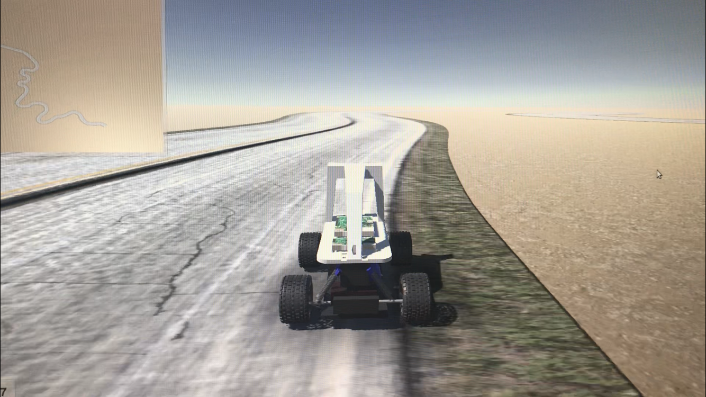](https://youtu.be/LuXiSPAWJ_I)

## Copy model to pi 
```
(donkey_3tk) rainer@neuron:~/dev/25-donkey_3tk$ 
scp /home/rainer/dev/25-donkey_3tk/mycar/models/shack1.h5 pi@siliconpi2:~/d2/models
```

## Run model on pi 
```
(env) pi@siliconpi1:~/mycar_autopilot $ 
python manage.py drive --model=models/shack1.h5  
python manage.py drive --model <path/to/model> --js
```

Hit the Select button to toggle between three modes - User, Local Angle, and Local Throttle & Angle.

User - User controls both steering and throttle with joystick

**Local Angle - Ai controls steering, user controls throttle**

Local Throttle & Angle - Ai controls both steering and throttle

When the car is in Local Angle mode, the NN will steer. You must provide throttle.
 
## 11. Watch pi camera 
```
(donkey_3tk) rainer@neuron:~/dev/25-donkey_3tk/mycar$ 
python ../donkey/scripts/remote_cam_view.py --ip=siliconpi2 

remote browser: http://siliconpi2:3233 
```

## Reinfocement Learning
	
	(donkey_3tk) rainer@neuron:~/dev/25-donkey_3tk/donkey_gym/examples/reinforcement_learning$ 
	python ddqn.py --sim /home/rainer/dev/25-donkey_3tk/DonkeySimLinux/donkey_sim.x86_64 
	
	Testing ppo trained net
	(donkey_3tk) rainer@neuron:~/dev/25-donkey_3tk/donkey_gym/examples/reinforcement_learning$ 
	python ppo_train.py --test --sim /home/rainer/dev/25-donkey_3tk/DonkeySimLinux/donkey_sim.x86_64 
	
	python ppo_train.py --sim /home/rainer/dev/25-donkey_3tk/DonkeySimLinux/donkey_sim.x86_64 --env_name donkey-generated-roads-v0
	
	python ppo_train.py --sim /home/rainer/dev/25-donkey_3tk/DonkeySimLinux/donkey_sim.x86_64 --env_name donkey-generated-roads-v0 --headless 1
	python ppo_train.py --sim /home/rainer/dev/25-donkey_3tk/DonkeySimLinux/donkey_sim.x86_64 --env_name donkey-generated-roads-v0 --headless 1 --multi

[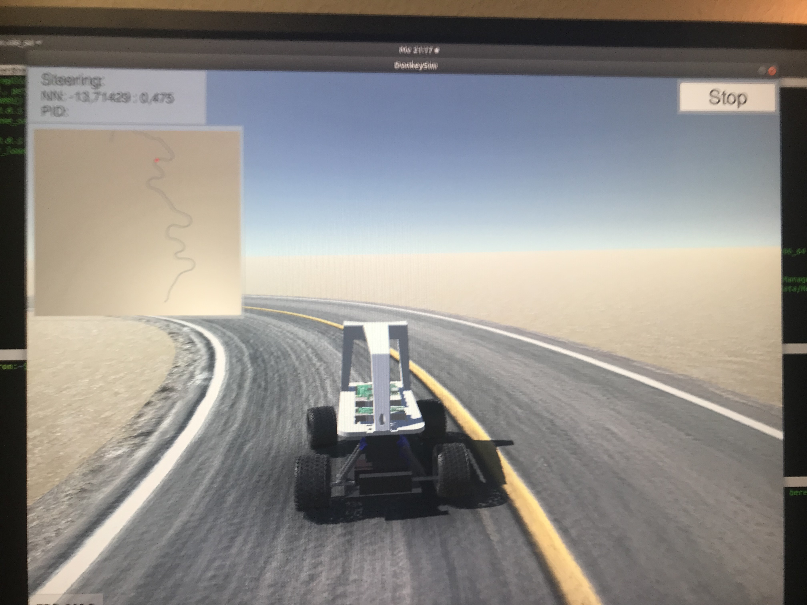](https://youtu.be/RxJFzar_0l4)


	(donkey_3tk) rainer@neuron:~/dev/25-donkey_3tk$ python donkey_gym/examples/supervised_learning/evaluate.py --model=siliconpi_neuron1_donkey2.h5
	using donkey v2.5.0t ...
	2019-01-15 18:42:56.116375: I tensorflow/core/platform/cpu_feature_guard.cc:141] Your CPU supports instructions that this TensorFlow binary was not compiled to use: AVX2 FMA
	binding to ('0.0.0.0', 9091)
	got a new client ('127.0.0.1', 40308)
	unknown message type scene_selection_ready
	connection dropped
	got a new client ('127.0.0.1', 40310)
	unknown message type car_loaded
	fps 20.194938775588813
	fps 19.99812811253143
	fps 20.00077822852299
	fps 20.002373023227776
	fps 19.99857054437418
	fps 20.001034790170067
	fps 19.998124298548927
	fps 20.001525041510646
	fps 20.000947997203312
	fps 19.998230137103345

